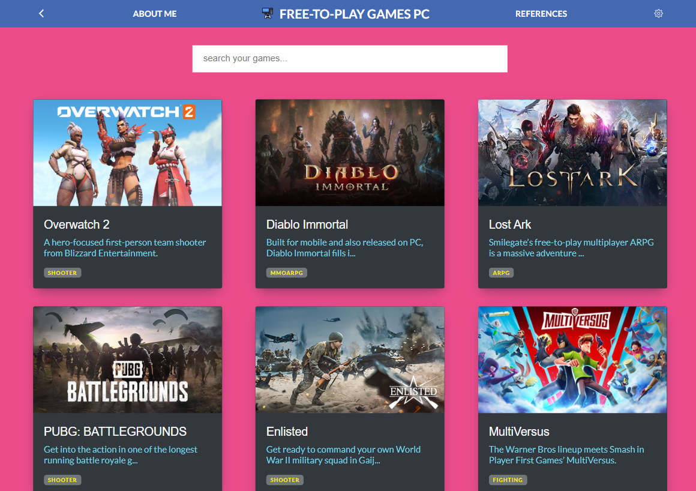
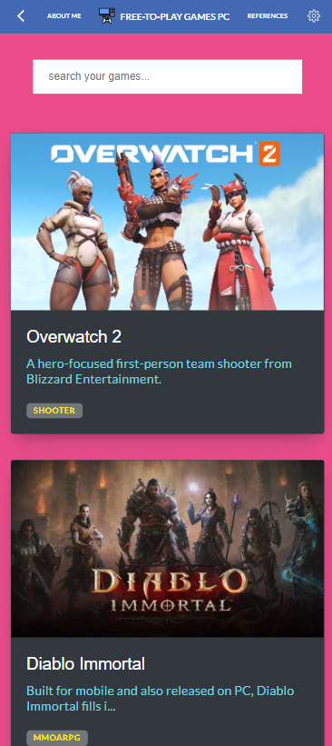

# Free-PC-Games-Rep
Free-PC-Games-Rep is a Single Page Application that shows the current trending free games for the PC Platform (data source is taken from FreeToGame API); This application retrieves game data and displays it to the user for informative purposes in a well-structured and interactive UI.


<h1>Free-PC-Games-Rep</h1>

<!-- TABLE OF CONTENTS -->
# 📗 Table of Contents

- [Free-PC-Games-Rep](#free-pc-games-rep)
- [📗 Table of Contents](#-table-of-contents)
- [📖 Free-PC-Games-Rep](#-free-pc-games-rep)
    - [How to build the "Free-PC-Games-Rep" application?](#how-to-build-the-free-pc-games-rep-application)
    - [Projects list](#projects-list)
      - [Day 1: Build file structure, prepare routes and navigations.](#day-1-build-file-structure-prepare-routes-and-navigations)
      - [Day 2: display a list of items data comes from the API, filtering them, and create the testing (unit tests and integration tests).](#day-2-display-a-list-of-items-data-comes-from-the-api-filtering-them-and-create-the-testing-unit-tests-and-integration-tests)
      - [Day 3: Styling the components, and testing for final details.](#day-3-styling-the-components-and-testing-for-final-details)
      - [Day 4: Final checkings, Deploying app.](#day-4-final-checkings-deploying-app)
  - [🛠 Built With ](#-built-with-)
    - [Tech Stack ](#tech-stack-)
    - [Tools i have used for this project ](#tools-i-have-used-for-this-project-)
    - [Key Features ](#key-features-)
  - [🚀 Live Demo ](#-live-demo-)
    - [Live Preview](#live-preview)
  - [💻 Getting Started ](#-getting-started-)
    - [Prerequisites](#prerequisites)
    - [Setup](#setup)
    - [Install](#install)
    - [Usage](#usage)
    - [Run tests](#run-tests)
    - [Deployment](#deployment)
  - [👥 Authors ](#-authors-)
  - [🔭 Future Features ](#-future-features-)
  - [🤝 Contributing ](#-contributing-)
  - [⭐️ Show your support ](#️-show-your-support-)
  - [🙏 Acknowledgments ](#-acknowledgments-)
  - [📝 License ](#-license-)

<!-- PROJECT DESCRIPTION -->
# 📖 Free-PC-Games-Rep<a name="about-project"></a>
> Free-PC-Games-Rep is a Single Page Application that shows the current trending free games for the PC Platform (data source is taken from FreeToGame API); This application retrieves game data and displays it to the user for informative purposes in a well-structured and interactive UI.

<!-- > Describe your project in 1 or 2 sentences. -->
### How to build the "Free-PC-Games-Rep" application?
I will build a single webapp application with several pages and sub-pages:
* /list of games (homepage)
  - /game details
* /about me
* /references

I would like to follow with these design guidelines, including:
- Colors
- Typography: font face, size and weight
- Layout: composition and space between elements
  
<p align="center">
  
</p>

original design idea by [Nelson Sakwa on Behance](https://www.behance.net/gallery/31579789/Ballhead-App-(Free-PSDs))

And here is my design for this project:
Desktop Version:
<p align="center">
  
</p>

Mobile Version:
<p align="center">
  
</p>

### Projects list
I will making "Free-PC-Games-Rep" use of React, Redux and consume API data from [Free To Game](https://www.freetogame.com/)

I will breakdown the projects that will guide me through the small steps each days. here the details about each of the work steps in the upcoming week.

- Day 1: Build file structure, prepare routes, and navigations.
- Day 2: display a list of items data comes from the API, filtering them, and create the testing (unit tests and integration tests).
- Day 3: Styling the components, and testing for final details.
- Day 4: Final checkings, Deploying app.

#### Day 1: Build file structure, prepare routes and navigations.
This is the first step of the Free-PC-Games-Rep web app. I will set up the environment and tools needed to develop a React Redux application.

- Set-up linters on local environments.
- Used correct flow GitFlow.
- Documentation the project in a professional way on README file.
- First, make sure I have [Node.js](https://nodejs.org/en/) installed on my local machine
- Setup a new React application using [Create React App](https://create-react-app.dev/)
- The application should run in the browser without errors

#### Day 2: display a list of items data comes from the API, filtering them, and create the testing (unit tests and integration tests).
Install [React Router V6](https://reactrouter.com/en/main/start/tutorial#setup)
[Setup router](https://reactrouter.com/en/main/start/tutorial#adding-a-router) inside of <App>
Add 3 routes in this application, each should render a pages components:
 - /
 - /game details
 - /about me
 - /references

Create components inside of the /components directory:
 - Contains a list of games to select
 - Contains a render list of details informations based on selected game
  
#### Day 3: Styling the components, and testing for final details.

#### Day 4: Final checkings, Deploying app.

## 🛠 Built With <a name="built-with"></a>

### Tech Stack <a name="tech-stack"></a>

<!-- > Describe the tech stack and include only the relevant sections that apply to your project. -->
<details>
  <summary>Client Side / Front-End</summary>
  <ul>
    <li><a href="https://www.w3.org/html/">HTML</a></li>
    <li><a href="https://www.w3.org/Style/CSS/">CSS</a></li>
    <li><a href="https://www.javascript.com/">Javascript</a></li>
    <li><a href="https://create-react-app.dev/">React</a></li>
    <li><a href="https://reactrouter.com/">React Router</a></li>
  </ul>
</details>

<details>
  <summary>Server Side / Back-End</summary>
  <ul>
    <li><a href="https://www.json.org/json-en.html">JSON</a></li>
    <li><a href="https://nodejs.org/en/">Node.js</a></li>
    <li><a href="https://redux.js.org/">Redux</a></li>
    <li><a href="https://www.iqair.com/">Air Quality API</a></li>
  </ul>
</details>

<details>
    <summary>Package, Library, Framework</summary>
      <ul>
        <li><a href="https://jestjs.io/">Jest</a></li>
        <li><a href="https://axios-http.com/docs/intro">axios</a></li>
        <li><a href="https://redux-toolkit.js.org/">Reduxjs Toolkit</a></li>
      </ul>
  </details>

<!-- Features -->
### Tools i have used for this project <a name="tools"></a>
  <details>
    <summary>Code Convention, Code Analysis</summary>
      <ul>
        <li><a href="https://eslint.org/">ESLint</a></li>
        <li><a href="https://webhint.io/">Webhint</a></li>
        <li><a href="https://stylelint.io/">Stylelint</a></li>
        <li><a href="https://chrome.google.com/webstore/detail/lighthouse/blipmdconlkpinefehnmjammfjpmpbjk?hl=en">Lighthouse</a></li>
        <li><a href="https://www.npmjs.com/package/npm-check">node_modules checker</a></li>
      </ul>
  </details>
  <details>
    <summary>Version Control, CI/CD, Hosting Service</summary>
      <ul>
        <li><a href="https://www.atlassian.com/git/tutorials/comparing-workflows/gitflow-workflow">GitFlow</a></li>
        <li><a href="https://pages.github.com/">Github Pages</a></li>
        <li><a href="https://github.com/features/actions">Github Actions</a></li>
        <li><a href="https://git-scm.com/">Git</a></li>
        <li><a href="https://vercel.com/">Vercel</a></li>
      </ul>
  </details>
  <details>
    <summary>IDE, Desktop Apps, Other Tools</summary>
      <ul>
        <li><a href="https://code.visualstudio.com/">Visual Studio Code</a></li>
        <li><a href="https://desktop.github.com/">Github Desktop</a></li>
        <!-- <li><a href="https://www.figma.com/">Figma</a></li> -->
      </ul>
  </details>

### Key Features <a name="key-features"></a>

- display a list of games 
- filtering informations based on selected game text
- single page apps (SPA)

<p align="right">(<a href="#readme-top">back to top</a>)</p>

<!-- LIVE DEMO -->
## 🚀 Live Demo <a name=""></a>

<!-- > Add a link to your deployed project. -->
- Click the following url for [... Live Demo ...](https://free-pc-games.onrender.com)

<p align="right">(<a href="#readme-top">back to top</a>)</p>

### Live Preview
[](https://www.loom.com/embed/7ad978a0fbca41acb568dd537ed9b344)

<!-- GETTING STARTED -->
## 💻 Getting Started <a name="getting-started"></a>

<!-- > Describe how a new developer could make use of your project. -->
To get a local copy up and running, follow these steps.

### Prerequisites

In order to run this project you need:
- git version 2.38.x
- node.js version > 12.x
- IDE (visual studio code, etc)
- browser (chrome, firefox, edge, safari)
- install the dependencies

### Setup

Clone this repository to your desired folder:

```sh
  cd free-pc-games-rep
  git git@github.com:fickryiman/Free-PC-Games-Rep.git
```


### Install

Install this project with:

```sh
  cd free-pc-games-rep
  npm install
```

### Usage

To run the project, execute the following command:

```sh
  npm run build (production environment)
  npm start (development environment)
```
Runs the app in the development mode.\
Open [http://localhost:3000](http://localhost:3000) to view it in your browser.

The page will reload when you make changes.\
You may also see any lint errors in the console.


### Run tests

To run tests, run the following command:
Run Github Actions Test
```sh
  npm test

  npx stylelint "**/*.{css,scss}"
  npx eslint "**/*.{js,jsx}"

  auto fix linter with --fix
  npx stylelint "**/*.{css,scss}" --fix
  npx eslint "**/*.{js,jsx}" --fix
```

### Deployment

You can deploy this project using:
GitHub Pages
Example:
```sh
git@github.com:fickryiman/Free-PC-Games-Rep.git
```

<p align="right">(<a href="#readme-top">back to top</a>)</p>

<!-- AUTHORS -->
## 👥 Authors <a name="authors"></a>

<!-- > Mention all of the collaborators of this project. -->

👤 **Fickry Bil Iman**

- GitHub: [@fickryiman](https://github.com/fickryiman)
- Facebook: [@fickry.bil.iman](https://www.facebook.com/fickry.bil.iman)
- LinkedIn: [fickry-bil-iman](https://www.linkedin.com/in/fickry-bil-iman)

<p align="right">(<a href="#readme-top">back to top</a>)</p>

<!-- FUTURE FEATURES -->
## 🔭 Future Features <a name="future-features"></a>

<!-- > Describe 1 - 3 features you will add to the project. -->
- add login to user with social media auth or google auth
- add games library for each user
- add likes, dislike counters

<p align="right">(<a href="#readme-top">back to top</a>)</p>

<!-- CONTRIBUTING -->
## 🤝 Contributing <a name="contributing"></a>

Contributions, issues, and feature requests are welcome!

Feel free to check the [https://github.com/fickryiman/Free-PC-Games-Rep/issues](../../issues/).

<p align="right">(<a href="#readme-top">back to top</a>)</p>

<!-- SUPPORT -->
## ⭐️ Show your support <a name="support"></a>

<!-- > Write a message to encourage readers to support your project -->

If you like this project please follow me on my GitHub: [@fickryiman](https://github.com/fickryiman) or connect on my LinkedIn: [@fickry-bil-iman](https://www.linkedin.com/in/fickry-bil-iman).

<p align="right">(<a href="#readme-top">back to top</a>)</p>

<!-- ACKNOWLEDGEMENTS -->
## 🙏 Acknowledgments <a name="acknowledgements"></a>

<!-- > Give credit to everyone who inspired your codebase. -->
Credits and Thanks to:
- Allah for the everythings, Alhamdulillah.
- My Families for all of the supports.
- Microverse for all of the experiences, lessons, projects.
- [Nelson Sakwa](https://www.behance.net/sakwadesignstudio/) for the website template design that inspired.
- [FreeToGame](https://www.freetogame.com/) for the games data and other important informations.
- [Flaticon](https://www.flaticon.com/) for the icons.


<p align="right">(<a href="#readme-top">back to top</a>)</p>

<!-- FAQ (optional) -->

<!-- ## ❓ FAQ (OPTIONAL) <a name="faq"></a>

<!-- > Add at least 2 questions new developers would ask when they decide to use your project. -->

<!-- - **[Question_1]** -->

  <!-- - [Answer_1] -->

<!-- - **[Question_2]** -->

  <!-- - [Answer_2] -->

<!-- <p align="right">(<a href="#readme-top">back to top</a>)</p> -->

<!-- LICENSE -->
## 📝 License <a name="license"></a>

This project is [MIT](./LICENSE) licensed.

<!-- Creative Commons License - Start -->
<!-- Shield: [![CC BY 4.0][cc-by-shield]][cc-by]

This work is licensed under a
[Creative Commons Attribution 4.0 International License][cc-by].

[![CC BY 4.0][cc-by-image]][cc-by]

[cc-by]: http://creativecommons.org/licenses/by/4.0/
[cc-by-image]: https://i.creativecommons.org/l/by/4.0/88x31.png
[cc-by-shield]: https://img.shields.io/badge/License-CC%20BY%204.0-lightgrey.svg -->
<!-- Creative Commons License - End -->

<p align="right">(<a href="#readme-top">back to top</a>)</p>
